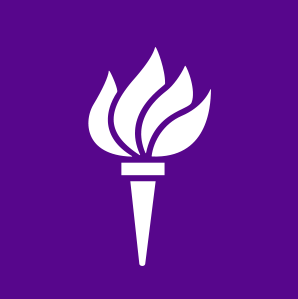

# adonis garcia

  
### ml engineer | cs @ nyu | building ai for good

---

## tech stack

**specialties:** rag systems • llms • vector databases • ml platforms • vibe coding

---

## experience

<table>
<tr>
<td align="center" width="25%">
 
<b>missionml</b> 
ml software engineer 
sep 2025 - present
</td>
<td width="2%"></td>
<td align="center" width="25%">
 
<b>bank of america</b> 
software engineering intern 
may 2025 - aug 2025
</td>
<td width="2%"></td>
<td align="center" width="25%">
 
<b>polydelta ai</b> 
ml software engineer 
jan 2024 - jun 2025
</td>
<td width="2%"></td>
<td align="center" width="25%">
 
<b>nyu tandon</b> 
teaching assistant 
jul 2023 - may 2024
</td>
</tr>
</table>

---

## 🏆 scholarships, awards, fellowships, & hackathon wins

your average dominican student 🇩🇴 | [portfolio](https://www.adonisgarcia.com/)

| # | achievement | award/prize | date |
|---|-------------|-------------|------|
| 17 | **Hispanic Scholarship Fund** | 💵 Scholarship | sep '25 |
| 16 | **NYUAD Hackathon for Social Good** | 🥈 2nd Place + 👏 Audience Choice Award | apr '25 |
| 15 | **Google x BASTA SWEP Tech Fellow** | 🎓 Google Fellowship Program | jan '25 |
| 14 | **Last Mile Scholarship** | 💵 Scholarship | dec '24 |
| 13 | **SHPE National Conference** | ✈️ GLASS Funded Attendance | nov '24 |
| 12 | **National Supermarket Association Scholarship** | 💵 Scholarship | oct '24 |
| 11 | **Hispanic Scholarship Fund** | 💵 Scholarship | sep '24 |
| 10 | **The Institute for Responsible Citizenship** | 🎓 DC Fellowship Program | jun '24 |
| 9 | **Management Leadership for Tomorrow Career Prep** | 📈 Professional Development | jan '24 |
| 8 | **NYU Sophomore of the Year** | ⭐ Academic Excellence | nov '23 |
| 7 | **National Supermarket Association Scholarship** | 💵 Scholarship | oct '23 |
| 6 | **Hispanic Scholarship Fund** | 💵 Scholarship | sep '23 |
| 5 | **NYU GLASS Honors Program** | 💰 $30k Funding | aug '23 |
| 4 | **NYU Scholar of the Year** | ⭐ Academic Excellence | may '23 |
| 3 | **NYU Gunter Georgi Award** | 🎖️ Innovation in Engineering Design | dec '22 |
| 2 | **NYU Outstanding Innovator Award** | 🏅 1 of 230+ students | dec '22 |
| 1 | **HEOP Scholar** | 🎓 Full Tuition | aug '22 |

---

## featured projects

### [q-quake](https://github.com/elucidator8918/NYUAD)
> quantum + ai earthquake detection system  
> `quantum computing` `pytorch` `apis` • 2nd place @ nyuad hackathon

### [the e-glove](https://github.com/adonis-garcia-git/e-glove)
> computer vision wireless mouse  
> `opencv` `arduino` `python` • won 2 innovation awards

### [portfolio website](https://adonisgarcia.com)
> personal portfolio showcasing projects and experiences  
> `html` `css` `javascript` `tailwindcss` • fully responsive design

### course q&a rag
> students ask, ai answers from course docs  
> `next.js` `pinecone` `fastapi` • analytics dashboard for professors

### cs learning platform
> personalized llm tutor teaching through your interests  
> `react` `claude api` `postgresql` • teaches gaming fans cs through game design

---

## quick facts

- first heop student at tandon to maintain 4.0 past freshman year
- backpacked 6 european countries in 10 days
- studied abroad in abu dhabi (2x) & seoul
- gaming & gym enthusiast
- mentor to 50+ underrepresented students
- powered by desire to make cool shit and my mom's sacrifices

---

## let's connect

**open to:** collaboration • mentorship • speaking • internships • post-grad opportunities • starting a company

### *"from the bronx to the world. writing code that would make my mother proud."*

---

**star my repos if you find them interesting**

